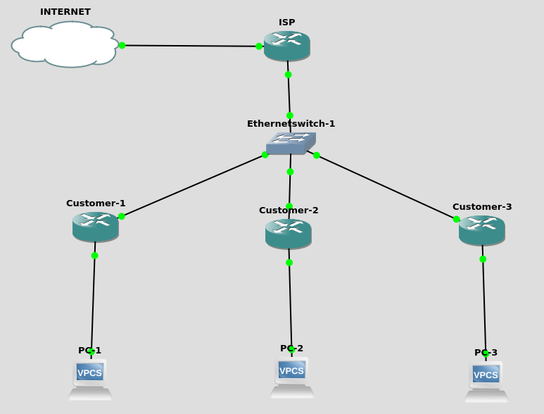

# ztp-mikrotik
Zero Touch Provisioning on Mikrotik

This repository contain python script to doing Zero Touch Provisioning on Mikrotik

<h3>Topology</h3>
This repository is tested using this Topology

<h3>Requirement</h3>
To run this repository, you need some python library installed on your computer.
<ul>
    <li>Python 3.6.5</li>
    <li>flask</li>
    <li>paramiko</li>
    <li>telepot</li>
</ul>

<h3>Setup</h3>
<ol>
    <li>Create Telegram bot, this telegram bot will used to notify us if the provisioning on Mikrotik completed. You can follow tutorial on https://docs.microsoft.com/en-us/azure/bot-service/bot-service-channel-connect-telegram?view=azure-bot-service-4.0</li>
    <li>Clone this repository</li>
        <ul>
            <li>git clone https://github.com/arrosid/ztp-mikrotik.git</li>
            <li>cd ztp-mikrotik</li>
        </ul>
    <li>Install requirement library</li>
        <ul>
            <li>pip install -r requirement</li>
        </ul>
    <li>Edit ztp_mikrotik.py. Fill the <i>'your_token'</i> and <i>'your_chat_id'</i></li>
    <li>Run the python script</li>
        <ul>
            <li>python3 ztp_mikrotik.py</li>
        </ul>
    <li>Configure PPPoE Server on ISP</li>
    <li><i>Add ppp_script_on_up.txt</i> to the on UP script in the PPP Server Profile. Modify the <i>'your_flask_server_ip_address'</i> become your Server IP Address </li>
    <li>Configure PPPoE Client on Customer, and see that you will reciev Telegram notification and the customer is provisioned automatically</li>
</ol>
